# Runtime architecture

`NvidiaHost` owns game-facing resources, native presentation references, UI
attachments and lifecycle. `SourceFrameCoordinator` orders the work;
allocation, context validation and retirement stay with their owners.

```mermaid
flowchart LR
    Game[Skyrim D3D11] --> Hooks[Engine hooks]
    Hooks --> Host[NvidiaHost]
    Host --> NR[Optional NR before DLSS]
    NR --> DLSS[DLSSBackend: D3D11 NGX]
    DLSS --> UI[Native menus and HUD]
    UI --> Backend[SourceDLSSG: D3D12 interop and session]
    Backend --> Late[Optional NR after DLSS and HDR conversion]
    Late --> Runtime[NVIDIA presentation runtime]
    Runtime --> Display[Swapchain output]
```

This diagram describes the full renderer. The standard build omits both
NR stages and Ada/Ampere compatibility at compile time; it retains the same DLSS, native
UI, HDR and presentation path. Shared settings keep optional preferences for
switching between the two builds. The standard menu omits NR controls and its
pipeline diagram runs directly from World to DLSS.

Only the selected NR placement evaluates. Two-pass NR uses separate feature
histories. NR eligibility is independent of the live frame-generation toggle.
Before-DLSS NR leaves native UI outside inference.

The NVIDIA host is required at startup for both DLSS and native-resolution DLAA.
The startup `FrameGeneration/Enabled` preference initializes the interpolation
request; turning it off retains the same host, reconstruction and UI path.
The live FG checkbox changes that request, and Save as default persists it.
Warmup/loading can temporarily suppress generation without changing the request.
There is no separate TAA-stage DLSS evaluator. Skyrim's own TAA pass stays off
while the retained jitter hook supplies NVIDIA's temporal inputs. Engine DRS
ratios stay at 1 because the host already supplies the render-sized buffer.

The presentation runtime requires compatible DLSS-G hardware/driver and
windowed/borderless mode even with interpolation off. Factory or required-host
initialization failure is fatal; the renderer does not continue on a second
presentation path. Display refresh is reported without choosing another host.

## Resource boundaries

`GameSwapChain` returns a stable render-size texture to Skyrim. The inner
`SourceDLSSG::SwapChain` manages shared D3D11/D3D12 presentation textures and the
rotating native swapchain. They have different buffer identities and lifetimes.

The host keeps UI drawing attachments separate from the stable textures tagged
for frame generation. Startup foreground draws at native resolution after
ordinary UI. Preview depth, color coverage, viewport and scissor dimensions must
match the attachment used at each boundary.

Queue completion and runtime input-reader retirement must precede resource reuse
or release. An unconfirmed NR creation submission retains its session resources.
Resize and teardown quiesce the backend before replacing owned resources.

DLSS creation receives the host input format with its extents. Live preset,
exposure and sharpening changes reuse that allocation contract after retirement;
evaluation does not recreate the feature. The overlay borrows the host's current
view or creates a temporary view for one draw. It retains no texture across
hidden frames or resource replacement.

DLSS-G's populated budget-warning state remains diagnostic. It does not alter
the user's generation request. Actual failed calls and failed retirement retain
their error handling. GPU timings, Present timing and runtime output counts
measure different things; none alone establishes physical frame cadence.

## Settings and external UI

`RendererSettingsController` coordinates draft, requested, effective and saved
state through existing owners. Overlay modules present Image, NR, FG and
performance controls. The public headers in `include/` define the startup-overlay,
late-overlay and texture-provider companion contracts.

`LoadingArtwork` owns the queued-transition hook and startup eligibility.
Its atomic setting is shared with the settings controller; applying a draft
changes the next eligible request without reinstalling the hook. It preserves
the engine's picker, message order and all other sender arguments. Eligibility
is reset on return to the main menu and resource retirement.

`LoadingScreenRoute` selects spatial reconstruction for loading backgrounds after
settled gameplay. `LoadingScreenUpscaler` applies bilinear RGBA8 scaling without
temporal guides or sharpening; native UI is composed afterward at output size.
The next successful DLSS evaluation resets temporal history. Both the route and
artwork hook use `LoadingWorldReadiness` to exclude startup and initial save
loading, including after returning to the title screen. Scaling is independent
of the artwork preference. NvidiaHost owns the scaler's resources and releases
them only after GPU retirement.

`compatibility/ImGuiCompat/ImGuiIntegration.cpp` is part of `TheosRenderPipeline.dll`. The
main plugin installs its eight producer adapters at SKSE post-load, after all
plugins have loaded. Internal calls use `NativeUIBridge`; public exports return
the same service tables. The integration uses the main log and reads
`TheosRenderPipelineImGui.ini` for adapter settings. Version-specific producer
checks remain independent. File hashing and module
lookup/range helpers are shared under `compatibility/Shared`. Point containment
excludes the range end; empty-span containment permits it.

The completed-scene overlay export retains its V1 ABI and reports unavailable.
The startup-overlay API remains active. It brackets external producer draws
with the native foreground transaction; its frame/target restoration stays in
the existing host owner. Vanity's fallback for inactive native input remains
in the integration; an active native input host bypasses that mouse remapping.

## MFG startup selection

The saved `SourceDLSSGMFGUnlock` flag allows Ada/Ampere compatibility. It is separate from
the effective `MFGRoute`. At D3D12 device creation, the existing CUDA query
matches that device's adapter LUID and identifies its architecture. With the
flag enabled, SM89 uses the Ada unlock and SM86 uses the experimental Ampere
bridge; other identified NVIDIA architectures use the native runtime.
A failed or ambiguous query stops startup.
An explicit false keeps the unmodified runtime without requiring this CUDA query.

Only the selected compatibility route installs or verifies patches. The UI and session
use `UsesCompatibilityUnlock()` for readiness checks. Native MFG
uses reported runtime capabilities directly, even with the default flag true.
Selection does not change saved requests or reselect a route during Present or resize.

For the Ada route, MFG retains the configured modules and locates patch targets
by their instruction and temporal-program structure. Whole-DLL hashes and
file-version allowlists do not decide compatibility. The legacy and named
temporal programs retain source/output checks around the transformation;
missing, ambiguous or unsupported targets fail visibly. The loader still
checks required exports and keeps one owner for the configured module paths.

The Ampere route prepares the configured provider before `slInit`. It builds
an immutable SM86 temporal clone from the existing validated transform, plans
the remaining PTX changes and architecture instructions, then publishes them.
The host intercepts `GetProcAddress` only in its `sl.common` and `sl.dlss_g`
modules. The bridge forwards NGX calls and confines NVAPI architecture exposure
to startup/FG scopes for the actual rendering adapter. Other features and
driver/OS failures keep their original results. No ReShade or global resolver
hook is required. Provider allocations, imports and module references remain
resident until process exit; preparation cannot run after feature creation.

Standard compiles out the Ampere bridge together with Ada/NR code. The Ampere
candidate requires real RTX 30-series gameplay validation; preparation tests
and successful forwarding on Ada do not establish Ampere rendering support.

## HDR

HDR encoding converts linear BT.709 RGBA16F to opaque full-range BT.2020/PQ
RGB10A2. It is output encoding, not a tone mapper. `HDRColorimetry.h` derives the
RGB-to-XYZ matrices from primary chromaticities and D65, then computes
`inverse(M2020) * M709`. No chromatic adaptation is needed because white matches.

Definitions come from [BT.709-6, items 1.3/1.4](https://www.itu.int/dms_pubrec/itu-r/rec/bt/R-REC-BT.709-6-201506-I!!PDF-E.pdf)
and [BT.2100-3, tables 2/4](https://www.itu.int/dms_pubrec/itu-r/rec/bt/R-REC-BT.2100-3-202502-I!!PDF-E.pdf).
The PQ encoder uses the published rational coefficients and 10,000-nit scale.
Negative components are clipped after gamut conversion.

Application white remains `10000 / 140` nits, about 71.43 nits, preserving the
existing brightness. This differs from Windows' 80-nit scRGB reference white.
